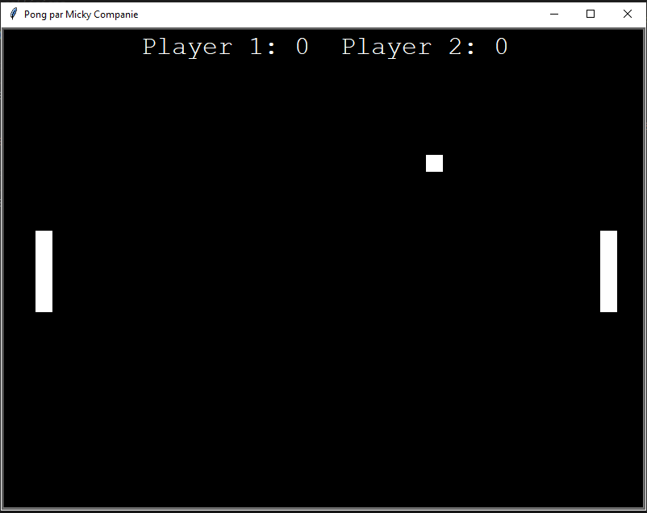
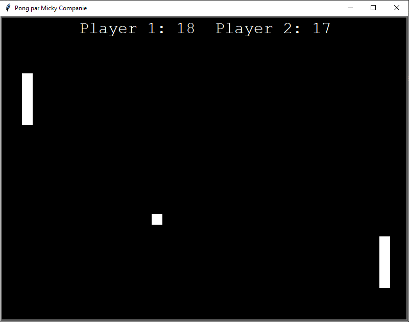

# Pong

This is a pong game i'm making to learn how to code in python.

## How to play ? 

on an __azerty keyboard__:    

player 1: "z" to go up, "s" to go down.    
player 2: up arrow to go up, down arrow to go down

## Who ?

this is a project entirely made by [__me__](https://github.com/MickyCompanie)    

## When ?

december 2019

## Screenshots:

    

    